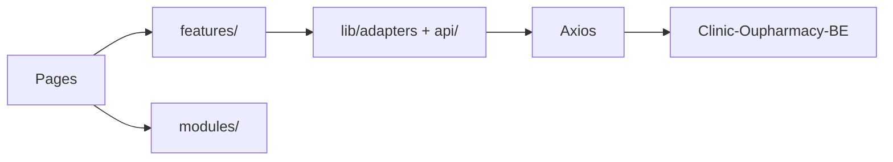

# Architecture — Clinic-Oupharmacy-FE

## Tổng quan

SPA **Vite + React**: routing client-side, gọi REST tới backend Django. Cấu hình endpoint tập trung (`src/config/APIs.js`). State: Context, Redux (tuỳ module), JWT qua `lib/auth/tokenManager`.

## Luồng dữ liệu (điển hình)

- **Trang** (`src/pages/`) — route mỏng; compose **features** hoặc **modules**.
- **Features** (`src/features/prescribing/`) — domain kê toa store-native (catalog, draft, API).
- **HTTP** — `config/APIs.js` + `authApi()`; adapter `lib/adapters/storeProduct.js`.

## Store-first prescribing (plan2)

| Luồng | API | Ghi chú |
|-------|-----|---------|
| Tìm thuốc / catalog | `GET /api/store/products/`, `/api/store/search/` | SoT: **storeApp** |
| Danh mục (kê toa + admin read-only) | `GET /api/store/categories/` | Không dùng mainApp `/categories/` cho prescribing |
| Thêm dòng kê toa | `POST /prescription-details/` | `product_variant_id` + `product_variant_unit_id` |
| Phiếu theo chẩn đoán | `GET /diagnosis/:id/` | Route FE: `/dashboard/prescribing/:diagnosisId` |

**Model:** `Product → ProductVariant → ProductVariantUnit` (`unit_options` trên variant).

**Adapter:** `normalizeStoreVariant` gắn `product_id`, `product_name` (không còn nested `medicine` shim). Hiển thị: `getVariantDisplayName`, `getPrescriptionLineDisplayName`.

**Draft:** `usePrescriptionDraft` + `draftLine.js`; `PrescribingContext` chỉ wire toast/submit.

## Ranh giới module

| Tầng | Vai trò |
|------|---------|
| `pages/` | Route + Helmet |
| `features/prescribing/` | Workspace, catalog, draft, store API |
| `modules/pages/` | Legacy/shared (examination, payment, diagnosis) |
| `lib/auth/permissions.js` | `canDiagnose`, `canPrescribe`, `canViewPayments` |

## Dashboard admin (2026)

- **Thuốc / Danh mục** — không còn trong sidebar; medicines redirect store URL.
- **`/dashboard/categories`** — read-only store tree (admin URL trực tiếp).

## Dashboard layout (single viewport)

Tất cả route `/dashboard/*` dùng shell **`DashboardLayout`** (`modules/common/layout/dashboard/`):

| Layer | File | Vai trò |
|-------|------|---------|
| Frame | `index.jsx` | `100vh`, `main` `overflow: hidden`, outlet `flex: 1` |
| Tokens | `styleTokens.js` | `DASHBOARD_PAGE_FRAME_SX`, `DASHBOARD_SURFACE`, spacing |
| List shell | `shell/DashboardPageShell.jsx` | Header + filter + scroll table + pagination footer |
| Split shell | `shell/DashboardSplitShell.jsx` | 30/70 panes, scroll riêng (conversations) |

**Quy tắc:** page con fill frame (`flex: 1; minHeight: 0`); scroll nội bộ qua `ou-scrollbar` / `DASHBOARD_SCROLL_CONTENT_SX`; không `calc(100vh)` trong page.

**Pattern theo loại trang:**

- **List** — examinations, prescribing list, categories → `DashboardPageShell`
- **Split** — profile, conversations (dashboard) → flex split hoặc `DashboardSplitShell`
- **Workspace** — prescribing detail → `PrescribingContentWrapper` + `PrescribingShell`
- **Scroll content** — home charts, waiting-room grid, doctor-schedules form, diagnosis, payments → `DASHBOARD_PAGE_FRAME_SX` + scroll body

Plan chi tiết: `.cursor/plans/[Done] dashboard-ui-refactor.plan.md`

Cập nhật file này khi đổi auth, base URL, ranh giới store vs mainApp, hoặc dashboard layout contract.
