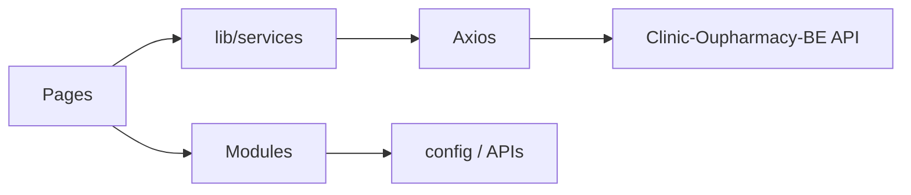

# Architecture — Clinic-Oupharmacy-FE

## Tổng quan

SPA **Vite + React**: routing client-side, gọi REST tới backend Django. Cấu hình endpoint tập trung (vd. `src/config/APIs.js`). State: Context, Redux (tuỳ module), local storage cho JWT khi áp dụng.

## Luồng dữ liệu (điển hình)

- **Trang** (`src/pages/`) compose **modules** và gọi **services**.
- **Services** dùng base URL / path từ **config** — khi đổi env hoặc version API, ưu tiên sửa một chỗ config trước khi rải URL rời.

## Ranh giới

| Tầng | Gợi ý |
|------|--------|
| UI / route | `pages/`, `modules/` |
| HTTP | `lib/services/` + `config/` |
| Auth toàn app | `lib/auth/`, provider trong `modules/providers` hoặc tương đương |

Cập nhật khi đổi cách auth, base URL, hoặc cấu trúc route lớn.
