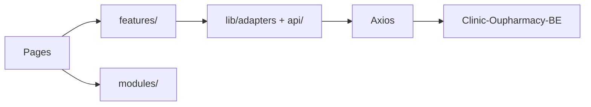

# Architecture — Clinic-Oupharmacy-FE

## Tổng quan

SPA **Vite + React**: routing client-side, gọi REST tới backend Django. Cấu hình endpoint tập trung (`src/config/APIs.js`). State: Context, Redux (tuỳ module), JWT qua `lib/auth/tokenManager`.

## Luồng dữ liệu (điển hình)

- **Trang** (`src/pages/`) — route mỏng; compose **features** hoặc **modules**.
- **Features** (`src/features/prescribing/`) — domain kê toa store-native (catalog, draft, API).
- **HTTP** — `config/APIs.js` + `authApi()`; adapter `lib/adapters/storeProduct.js`.

## Store-first prescribing (plan2)

| Luồng | API | Ghi chú |
|-------|-----|---------|
| Tìm thuốc / catalog | `GET /api/store/products/`, `/api/store/search/` | SoT: **storeApp** |
| Danh mục (kê toa + admin read-only) | `GET /api/store/categories/` | Không dùng mainApp `/categories/` cho prescribing |
| Thêm dòng kê toa | `POST /prescription-details/` | `product_variant_id` + `product_variant_unit_id` |
| Phiếu theo chẩn đoán | `GET /diagnosis/:id/` | Route FE: `/dashboard/prescribing/:diagnosisId` |

**Model:** `Product → ProductVariant → ProductVariantUnit` (`unit_options` trên variant).

**Adapter:** `normalizeStoreVariant` gắn `product_id`, `product_name` (không còn nested `medicine` shim). Hiển thị: `getVariantDisplayName`, `getPrescriptionLineDisplayName`.

**Draft:** `usePrescriptionDraft` + `draftLine.js`; `PrescribingContext` chỉ wire toast/submit.

## Ranh giới module

| Tầng | Vai trò |
|------|---------|
| `pages/` | Route + Helmet |
| `features/prescribing/` | Workspace, catalog, draft, store API |
| `modules/pages/` | Legacy/shared (examination, payment, diagnosis) |
| `lib/auth/permissions.js` | `canDiagnose`, `canPrescribe`, `canViewPayments` |

## Dashboard admin (2026)

- **Thuốc / Danh mục** — không còn trong sidebar; medicines redirect store URL.
- **`/dashboard/categories`** — read-only store tree (admin URL trực tiếp).

Cập nhật file này khi đổi auth, base URL, hoặc ranh giới store vs mainApp.
